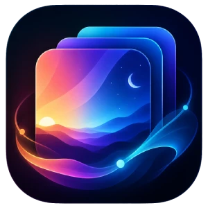
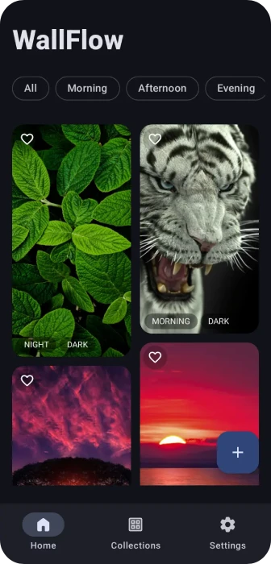
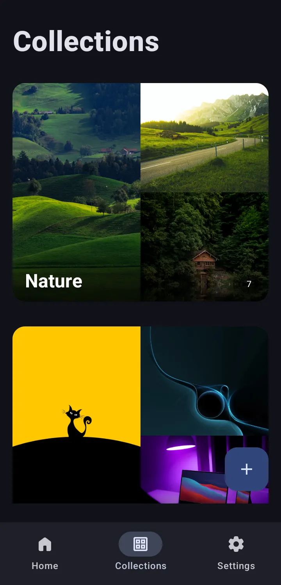
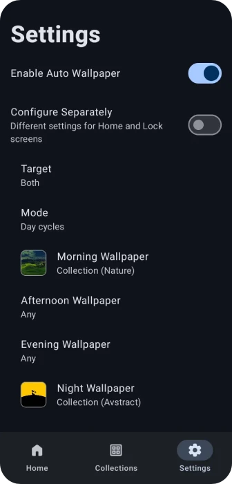

# WallFlow

<div align="center">



**A modern local wallpaper manager and scheduler for Android**

Manage, organize, and automatically rotate wallpapers from your personal collection with powerful
scheduling options and a beautiful Material 3 interface.


</div>

---

## ✨ Overview

WallFlow is an offline-first wallpaper management application that helps users organize their
wallpaper library and automatically switch wallpapers based on time, day cycles, system theme, or
custom schedules.

Unlike most wallpaper applications, WallFlow focuses on **your personal wallpaper collection**.
Import wallpapers, organize them into collections, create automated wallpaper schedules, and let
WallFlow keep your device fresh throughout the day.

---

## 🚀 Features

### Wallpaper Library

* Browse wallpapers in a modern masonry grid
* Import wallpapers from device storage
* Organize wallpapers into collections
* Create custom collections
* Rename collections
* Delete collections
* Mark wallpapers as favorites
* Wallpaper preview and management

### Automatic Wallpaper Scheduling

WallFlow can automatically change wallpapers using multiple scheduling modes:

#### Time-Based

Change wallpapers at a fixed interval:

* Every 15 minutes
* Every 30 minutes
* Every hour
* Custom intervals

#### Day & Night

Automatically switch between:

* Day wallpaper
* Night wallpaper

#### Day Cycles

Assign different wallpapers for:

* Morning
* Afternoon
* Evening
* Night

#### Weekly Rotation

Schedule wallpapers for specific days of the week.

#### System Theme Based

Automatically change wallpapers when the system switches between:

* Light Theme
* Dark Theme

### Wallpaper Targets

Choose where wallpapers are applied:

* Home Screen
* Lock Screen
* Both Screens

### Modern Android Experience

* Material 3 design
* Dynamic Material You colors
* Light theme
* Dark theme
* System theme support
* Smooth Compose animations
* Fully offline operation

---

## 📸 Screenshots

### Home Screen

Displays your wallpaper library with category filters, favorites, and quick actions.

<div align="center">

</div>

### Collections

Create and manage wallpaper collections with beautiful collage previews.
<div align="center">

</div>

### Scheduler & Settings

Configure automatic wallpaper changes for home and lock screens independently.

<div align="center">

</div>

---

## 🏗 Architecture

WallFlow follows the **MVVM (Model–View–ViewModel)** architecture pattern.

```text
UI (Jetpack Compose)
        │
        ▼
ViewModel
        │
        ▼
Repository
        │
 ┌──────┴──────┐
 ▼             ▼
Room      DataStore
```

### Layers

#### UI Layer

* Jetpack Compose
* Material 3
* Navigation

#### Domain Layer

* Business logic
* Wallpaper scheduling logic
* Collection management

#### Data Layer

* Room Database
* DataStore Preferences
* Local file storage

---

## 🛠 Tech Stack

### Core

* Kotlin
* Coroutines
* Flow

### UI

* Jetpack Compose
* Material 3
* Material You
* Navigation 3

### Storage

* Room Database
* DataStore Preferences

### Background Processing

* WorkManager

### Media

* Coil

---

## 📱 Requirements

### Development

* Android Studio Koala or newer
* JDK 17+
* Android SDK 26+

### Device

* Android 8.0 (API 26) or newer

---

## 🎯 Roadmap

* [ ] Wallpaper search
* [ ] Backup & Restore
* [ ] Improved collection management
* [ ] Enhanced scheduler options
* [ ] Live wallpaper support
* [ ] ML-powered smart tagging
* [ ] Automatic wallpaper classification
* [ ] Custom tag system
* [ ] Advanced wallpaper discovery

---

## 🤝 Contributing

Contributions are welcome.

Whether you're fixing bugs, improving performance, enhancing UI, or proposing new features, feel
free to open an issue or submit a pull request.

### Development Workflow

1. Fork the repository
2. Create a feature branch
3. Commit your changes
4. Push your branch
5. Open a Pull Request

---


